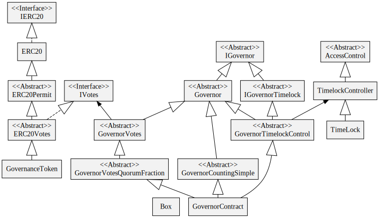

# On-chain Governance
See [Docs](https://docs.openzeppelin.com/contracts/4.x/governance) for details

## @openzeppelin/contracts/token/ERC20/ERC20.sol
  Implements the ERC20 contract interface which does the following:
  - Extends the Context contract which adds the _msgSender() and _msgData() functions for accessing msg.sender and msg.data properties respectively. These methods can be overridden in some circumstances.
  - Implements a contract that provides a way to
    - Track a collection of shares (totalSupply()) 
    - Record a balance for every person that has shares (balanceOf())
    - Allow people to transfer shares to others (transfer())
    - Permit people to approve the spending of some of their shares by someone else (allowance(), approve(), transferFrom())
  - Implements the ERC712 (permit()) interface to allow callers to change allowances using a message signed by the owner account. This is important because it makes it easier for wallet owners to verify what they are signing when interacting with wallets like MetaMask
  - IMPORTANT: this contract does not offer any iterator for viewing all token balances. I temporarily added a method to do this (GovernanceToken.shareholders), but we will probably have to move this data off chain.

## @openzeppelin/contracts/token/ERC20/extensions/ERC20Votes.sol
  Implements a contract giving voting power to token holders based on their token balance. This is an ERC20 extension...that is, a child of the ERC20 contract...it is not a standard interface
  - Implements delegate() to allow token holders to share voting power with others - this happens without affecting the token balance. Note, you HAVE to delegate to yourself first before you can vote. Also, actual voting events happen through a Governor contract - not here.
  - Implements delegateBySig() in ERC20Votes to allow callers to delegate voting power to others using a message signed by the owner account
  - Implements a "checkpoint" feature that keeps track of voting power and total supply of token balance on a block by block basis. This lets you query the voting power for any given past block. This is useful if you want voting power to be based on a the state of a previous block rather than recent trading history.

## @openzeppelin/contracts/governance/Governor.sol
  Implements an abstract contract for creating, voting on, and executing proposals. 
  - Derives from Context which adds the _msgSender() and _msgData() functions for accessing msg.sender and msg.data
    properties respectively. These methods can be overridden in some circumstances.
  - Tracks multiple proposals and their states
    - Handles the proposal states: Pending, Active, Defeated, Succeeded, Expired
    - Note: Some states are managed by this Governor. And some are managed by the child contract GovernorTimelockControl
  - Has a generic function for casting votes using an 8-bit int but interpretation of the int and counting the votes is delegated to a derived class (GovernorCountingSimple)
    - Contains a reference to an IVotes contract (in our case this is the GovernanceToken) which is used to determine the voting power of the voter
  - A proposal consists of
    - A list of target contracts that will be modified
    - An amount of ETH sent to each contract
    - Encoded function names and arguments for each target
    - A description of the proposal
  - Implements castVoteBySig() to allow callers to vote on behalf of someone else using a message signed by the owner account (this is not the same as delagation which does not require a signature)
  - Defines a function called executor() which determines who can execute a proposal. By default this is the Governor contract. However it can be overridden, and in fact it IS overridden by GovernorTimelockControl described later to ensure only the timelock contract can execute the proposal.
  - Defines a modifier called onlyGovernance which restricts certain function calls to the executor()
  - IMPORTANT: this contract does not record the details of the proposals and offers no iterator for viewing active proposals. I temporarily added an API handler to the frontend to do this, we will need a better solution - maybe a serverless database. The hashing algorithm used in the Contract ensure that the proposals cannot be tampered with.

## @openzeppelin/contracts/governance/extensions/GovernorCountingSimple.sol
  This contract derives from Governor and adds functions for voting
  - Type of vote (for, against, abstain)
  - Who voted
  - Voting power comes from Governor
  - Determine if quorum reached and if vote succeeded

## @openzeppelin/contracts/governance/extensions/GovernorVotes.sol
  This contract derives from Governor and contains a reference to the an IVotes implementation (ERCVotes <- GovernanceToken). It also adds a function for determining voting power by getting it from the IVotes interface.

## @openzeppelin/contracts/governance/extensions/GovernorVotesQuorumFraction.sol
  This contract derives from GovernorVotes and implements quorum(blockNumber) and indicates what the configured quorum percentage is

## @openzeppelin/contracts/governance/extensions/GovernorTimelockControl.sol
  This abstract contract wraps a reference to a TimelockController contract. 
  - Extends Governor
  - Handles the proposal states: Executed, Queued, Cancelled
  - Implements queue() and _execute() and _cancel() by forwarding them to the TimelockController
  - Allow onlyGovernance to change the TimelockController reference to a new one

## @openzeppelin/contracts/governance/TimelockController.sol
  This is a contract that uses low-level message passing for running arbitrary function calls on predefined contracts after a minimum delay has passed. 
  Calls are made using the The contract keeps track of when function calls are queued by hashing the details of the function call. Then when the execute method is called on the same data, it checks if the minimum amount of time has passed, otherwise the execution fails. (Note: It does not keep the details of the call, only a hash of it so that it can confirm it is the same call)

  The steps to execute an operation on a given contract are as follows:
  - Call queue() on the Governor contract with the hash of the function name and arguments. This will save the hash plus a timestamp. 
  - Call execute(). This will check if the enough time has passed since the timestamp associated with the hash. 
  - The TimelockController needs to have been given permission to execute the functions in the target contracts

## @openzeppelin/contracts/access/AccessControl.sol
Contract module that allows derived children to implement role-based access control mechanisms.
- This is extended by the TimelockController which defines roles in the constructor for proposers, executors, and self administration (which by default is itself only).

## Ethers.js
Similar to web3.js, the ethers.js library aims to be a complete and compact library for interacting with the Ethereum Blockchain and its ecosystem.
## Hardhat.js

## Topics
- TypeChain is a tool that
  - Generates Typescript type definition files (*.ts) from ABI files (*.json) 
  - Generates type information for ether.js, web3.js, Truffle, etc.
  - Allows you to interact with your contracts from TS code in a type-safe manner
[Gnosis Safe](https://gnosis-safe.io/)
Check dependencies
Learn Chai, Waffle, Typechain, others
hardhat.config.ts use
Solana
Elliptic Curve Digital Signature Algorithm